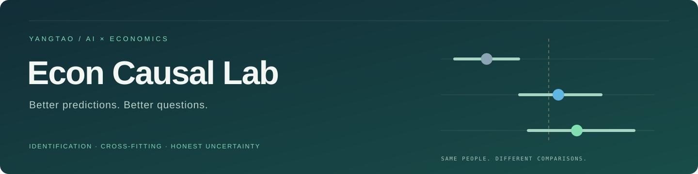
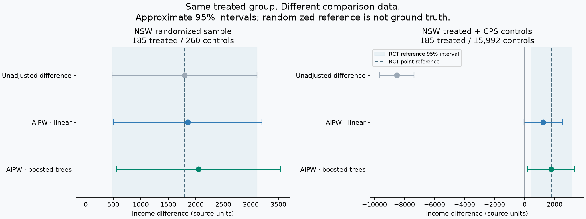
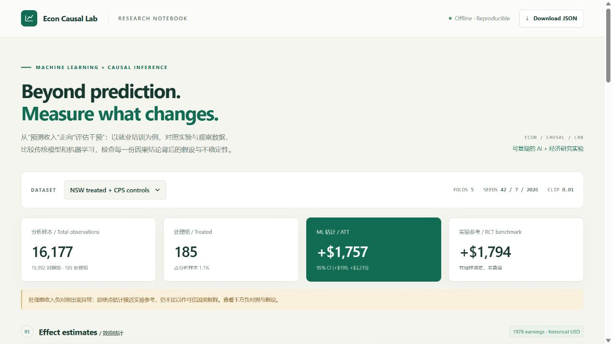

<p align="center">
<a href="https://github.com/Yangtao666China/causal-effect-estimation/actions/workflows/tests.yml"></a>


<a href="LICENSE"></a>
</p>

<h1 align="center">因果效应估计：职业培训政策评估</h1>
<p align="center">A reproducible causal machine-learning workbench for economic research.</p>

给定一个职业培训项目，如何判断它是否提高了参与者的收入？直接比较两组人、用机器学习预测收入、估计培训的因果效应，是三个不同的问题。

Econ Causal Lab 把**经典经济学数据、交叉拟合双重稳健估计、诊断与可复现报告**放进一个小型研究工具。既可以复现 NSW/CPS 职业培训案例，也可以导入自己的数值 CSV，检查 ATT 估计、样本重叠、协变量平衡和参数敏感性。

## 从哪里开始

| 你想做什么 | 入口 |
|---|---|
| 先看实验结论 | [研究结果](docs/findings.md) · [效应图](artifacts/effects.png) |
| 交互查看所有结果 | 下载 [report.html](artifacts/report.html) 后在浏览器打开 |
| 复现实验 | 下方 Quick start |
| 用自己的数据 | `econ-causal analyze` |
| 理解识别与公式 | [方法说明](docs/methodology.md) |
| 准备研究讨论或面试 | [研究讲解指南](docs/research_guide.md) |
| 核查数据与许可 | [Data card](docs/data_card.md) |



## 它实际做了什么

- **两套真实数据设计**：185 名 NSW 受训者 + 260 名随机对照；同一批受训者 + 15,992 名 CPS 观察性对照。数据来自研究者维护的 [原始下载页](https://users.nber.org/~rdehejia/nswdata2.html)。
- **三种比较**：未调整均值差、线性 nuisance 模型的 AIPW、梯度提升树 nuisance 模型的 AIPW。
- **交叉拟合**：5 折，预处理仅在各训练折拟合，反事实收入模型只在训练折对照组拟合。
- **不确定性与敏感性**：近似 95% 影响函数区间、不同分折种子、倾向得分截断阈值、控制组有效样本量。
- **经济学验证**：协变量平衡检查，以及将培训前收入设为结果的负对照检查。
- **已知真值仿真**：良好重叠、弱重叠、隐藏混杂三种情景，比较偏差、RMSE 和区间覆盖率。
- **离线交互报告**：切换数据与方法、查看效应图/重叠图/平衡图、导出 JSON；没有 CDN 和外部网络请求。

## Quick start



需要 Python 3.10+，CPU 即可。建议使用虚拟环境：

```bash
git clone https://github.com/Yangtao666China/causal-effect-estimation.git
cd causal-effect-estimation
python -m venv .venv
# Windows: .venv\Scripts\activate
# macOS / Linux: source .venv/bin/activate
python -m pip install -e .

# 真实数据案例 + 已知效应仿真
python -m econ_causal_lab benchmark --output outputs/study
```

第一次运行会从研究者的数据页下载三个文件，并验证 SHA-256；缓存保存在 `data/raw/`。原始微观数据不随本仓库发布。源数据限署名非商业使用，按其要求引用原论文；具体说明见 [Data card](docs/data_card.md)。软件的 MIT 许可不改变数据条款。

```bash
# 有缓存后完全离线复现
econ-causal benchmark --offline --output outputs/offline

# 只跑真实数据部分，跳过 Monte Carlo
econ-causal benchmark --repetitions 0 --output outputs/quick

# 增加仿真次数
econ-causal benchmark --repetitions 200 --simulation-n 1000 --output outputs/mc200

python -m unittest discover -s tests -v
```

输出包含 `report.html`、完整 `results.json`、估计/敏感性/仿真 CSV 和可用于展示的 PNG 图表。GitHub 不在文件预览中执行 HTML，需先下载再打开。

## 用自己的数据

仓库附有可公开分享的 [合成 CSV](examples/synthetic.csv)，先用它跑通：

```bash
econ-causal analyze examples/synthetic.csv --outcome outcome --treatment treatment --features x0,x1,x2,x3,x4 --output outputs/my-study
```

把路径和列名换成你的数据即可。当前接口要求：

- 每行一个独立观察，处理变量严格取 0/1，结果是连续数值。
- 只传入**处理前**协变量；程序禁止把结果或处理列混入特征。
- 所选列须为有限数值，无缺失值；类别编码、缺失值策略与样本筛选由研究者明确规定。
- 不适用于未调整的面板/聚类/时间序列、连续处理、多值处理或自动政策分配。

工具无法从列名验证研究设计。自有 CSV 不会与 NSW 参考值比较，也不会伪造实验对照。

## 方法的核心

估计目标为受训者平均处理效应：`ATT = E[Y(1) − Y(0) | D=1]`。

令 `e(X)=P(D=1|X)`、`m0(X)=E[Y|D=0,X]`，用折外预测构造：

```text
ATT = sum{ D·(Y−m0) − (1−D)·e/(1−e)·(Y−m0) } / sum(D)
```

这是一种经典双重稳健 ATT score 的直接实现；机器学习用于估计 nuisance functions。区间是渐近近似，有限样本覆盖率不作保证。**随机实验参考值有抽样误差；更接近它不等于证明识别成功。** 详见 [公式、影响函数与假设](docs/methodology.md)。


## 代码地图

```text
econ_causal_lab/
  data.py          # 来源、完整性校验、自有 CSV 输入
  estimators.py    # 折外预测、ATT score、影响函数、重叠与平衡
  experiment.py    # 固定分析方案、负对照、结果导出
  simulation.py    # 已知真值的 Monte Carlo
  report.py        # 离线交互报告
  plots.py         # 静态研究图
docs/              # 方法、数据、结果、研究讲解指南
notebooks/         # 从聚合结果读懂案例
tests/             # 数值、数据隔离、输入校验、报告安全
```

## 研究边界

这里是一个研究复现与方法诊断项目，不提出新的因果估计理论。观察性分析依赖不可直接检验的识别假设；更好的预测模型不能自动消除遗漏混杂。历史美国职业培训样本也不能直接回答当前中国某项政策是否有效。

模型配置预先固定，不根据“谁最接近随机参考”挑选模型或种子。第一个种子给出主点估计和区间，其余种子只显示分折变化范围，不能当作置信区间。

## 参考与贡献

- LaLonde (1986), *Evaluating the Econometric Evaluations of Training Programs with Experimental Data*.
- Dehejia & Wahba (1999, 2002)：数据发布者要求引用的两项研究，详见 [数据页](https://users.nber.org/~rdehejia/nswdata2.html)。
- Chernozhukov et al., [Double/Debiased Machine Learning for Treatment and Causal Parameters](https://arxiv.org/abs/1608.00060)。
- [DoubleML ATT score 文档](https://docs.doubleml.org/stable/guide/scores.html)：估计方程与影响函数的核对来源。
- Imbens & Xu, [Comparing Experimental and Nonexperimental Methods](https://arxiv.org/abs/2406.00827)：重叠与验证练习的重要性。

项目使用 AI 辅助开发，公开数据来源、分析配置、数值测试与实际运行结果。欢迎按 [贡献指南](CONTRIBUTING.md) 提交可复现问题。接下来值得扩展的方向是集群稳健推断、单侧 ATT 权重截断与更完整的安慰剂设计。
