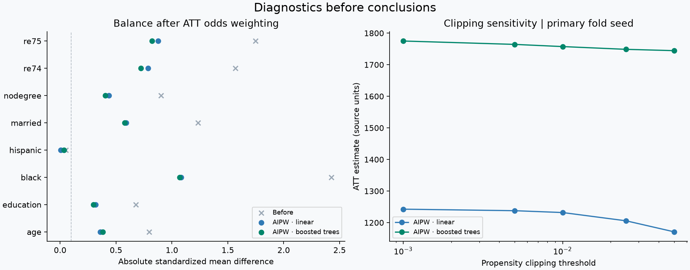
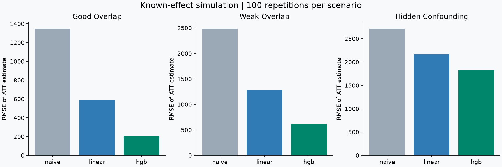

# 研究结果：一个接近参考的点估计，仍可能缺乏因果可信度

本页由 `artifacts/results.json` 中的实际运行数值生成。真实数据采用 5 折、主种子 42、额外分折种子 7/2026、propensity 截断 0.01；模型配置固定，未依据实验参考选择算法。复现命令：

```bash
python -m econ_causal_lab benchmark --output artifacts
python scripts/build_research_notes.py
```

## 1. 更换比较组，未调整差异发生反转

两套数据使用同一批 185 名受训者。NSW 随机对照与 CPS 调查对照具有不同的选择机制。下表单位沿用数据源的历史美元，未换算当前购买力。

| 数据 | 方法 | 点估计 | 近似 95% 区间 | 3 次分折的点估计范围 |
|---|---|---:|---|---|
| NSW randomized sample | Unadjusted difference | 1,794.3 | [479.2, 3,109.5] | [1,794.3, 1,794.3] |
| NSW randomized sample | AIPW · linear | 1,854.6 | [508.2, 3,201.0] | [1,769.5, 1,854.6] |
| NSW randomized sample | AIPW · boosted trees | 2,050.8 | [564.6, 3,537.0] | [2,050.8, 2,175.3] |
| NSW treated + CPS controls | Unadjusted difference | -8,497.5 | [-9,641.0, -7,354.0] | [-8,497.5, -8,497.5] |
| NSW treated + CPS controls | AIPW · linear | 1,232.0 | [-38.9, 2,502.8] | [1,231.0, 1,248.3] |
| NSW treated + CPS controls | AIPW · boosted trees | 1,757.4 | [199.4, 3,315.4] | [1,538.6, 1,757.4] |

随机实验未调整差异约为 +1,794，而更换为 CPS 对照后未调整差异约为 −8,498。线性和树模型的 AIPW 调整明显改变点估计，但不能仅凭调整后的结果接近随机参考就宣布识别成功。两套分析共享受训者，估计相关；这里没有把它们当独立估计进行显著性差异检验。分折范围不是置信区间。

## 2. 对照数量很多，不等于受训者的反事实信息充分

| 数据 | 模型 | 原始对照人数 | 加权对照 ESS | 被截断比例 |
|---|---|---:|---:|---:|
| NSW randomized sample | linear | 260 | 206.4 | 0.0% |
| NSW randomized sample | hgb | 260 | 172.5 | 0.0% |
| NSW treated + CPS controls | linear | 15,992 | 1,239.5 | 89.5% |
| NSW treated + CPS controls | hgb | 15,992 | 230.3 | 92.7% |

ESS 描述权重集中程度，并不证明重叠充分或模型正确。这里对 CPS 大量低 propensity 对照进行下端截断；因此截断比例高不等于大量受训者 e 接近 1，需结合组内分布与分组截断比例阅读。双侧截断也可能改变不相关对照的权重，这是当前协议的局限与后续研究问题。



## 3. 负对照揭示“数值接近”之外的问题

结果变量换成按数据设计视为处理前的 1975 年收入，协变量中移除 `re75`。其余使用主种子和固定配置。

| 数据 | 方法 | 负对照估计 | 近似 95% 区间 |
|---|---|---:|---|
| NSW randomized sample | Unadjusted difference | 265.1 | [-332.7, 863.0] |
| NSW randomized sample | AIPW · linear | 433.7 | [-38.2, 905.6] |
| NSW randomized sample | AIPW · boosted trees | 86.4 | [-427.9, 600.7] |
| NSW treated + CPS controls | Unadjusted difference | -12,118.7 | [-12,604.4, -11,633.1] |
| NSW treated + CPS controls | AIPW · linear | -1,337.8 | [-1,863.1, -812.5] |
| NSW treated + CPS controls | AIPW · boosted trees | -1,212.2 | [-1,802.4, -622.0] |

NSW 随机样本各方法的区间包含 0，而 CPS 观察性样本两个调整后估计的区间仍不包含 0。培训无法改变过去；这提示选择机制、条件模型或负对照设计存在值得调查的问题。负对照依赖它自己的假设，不能单独证明是哪一种偏差；同样，未拒绝零也不能证明无混杂。

## 4. 模拟中能看到机器学习的帮助与边界

每人的真实处理效应恒为 2,000。每种情景独立生成 100 份、每份 1,000 行数据，共 300 份数据、900 个方法估计；每次 3 折。线性模型不包含模拟中的所有非线性项，因此不是“正确指定的经济计量模型”对照。此设计比较固定学习器在这些机制下的行为，不能概括为机器学习普遍优于传统模型。

| 情景 | 方法 | 偏差 | RMSE | 95% 区间覆盖率 |
|---|---|---:|---:|---:|
| good_overlap | Unadjusted difference | 1,335.6 | 1,347.6 | 0% |
| good_overlap | AIPW · linear | 565.5 | 587.2 | 6% |
| good_overlap | AIPW · boosted trees | 88.5 | 203.5 | 94% |
| weak_overlap | Unadjusted difference | 2,481.0 | 2,485.8 | 0% |
| weak_overlap | AIPW · linear | 1,252.2 | 1,286.6 | 1% |
| weak_overlap | AIPW · boosted trees | 531.8 | 609.5 | 49% |
| hidden_confounding | Unadjusted difference | 2,707.6 | 2,713.7 | 0% |
| hidden_confounding | AIPW · linear | 2,163.9 | 2,171.1 | 0% |
| hidden_confounding | AIPW · boosted trees | 1,816.0 | 1,828.5 | 0% |

良好重叠且无隐藏混杂时，树模型明显减少了线性错设带来的偏差；弱重叠时，其区间覆盖率下降，出现隐藏混杂时仍有很大偏差。**更灵活的条件模型没有替研究者解决识别问题。**

覆盖率是 100 次重复的经验比例，不是精确的总体概率。例如 0/100 只代表本次没有覆盖，不能推断总体覆盖概率严格为零。经验比例存在 Monte Carlo 误差，不能用 94% 与 95% 的细小差别断言区间完全校准。



## 5. 可以继续形成研究问题的地方

1. **ATT 单侧截断**：只限制高 propensity 与双侧截断相比，如何影响估计、ESS 和 bias/coverage？预先规定模拟方案，不按真实参考挑阈值。
2. **更丰富但预先固定的线性基线**：加入二次项、交互项，与树模型比较拟合与因果估计，区分算法能力和特征规格。
3. **不同负对照设计**：核查收入测量期、样本选择与更多处理前变量，不能只删去一个失败检查。
4. **更严格的推断**：检验小处理组样本下的影响函数近似，以及聚类样本应如何改变推断。

## 运行记录与来源

完整配置、Python/依赖版本、各分折结果、每次模拟记录、数据 URL 与 SHA-256 随 [artifacts](../artifacts/) 提供。原始微观数据不在仓库中。

方法与识别假设见 [methodology.md](methodology.md)，数据及必须引用的 LaLonde 1986、Dehejia-Wahba 1999/2002 文献见 [data_card.md](data_card.md)。本项目是 AI 辅助的实现与复现实验，不声称新的因果估计理论或已完成的学术论文。
